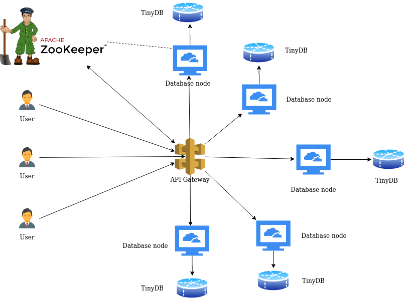
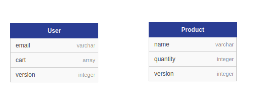

# Shopping Cart API Assignment

## Problem Statement Breakdown

- Architecture

- Schema Design

- Database nodes API design
  - Database used in each node - `TinyDB`.
  - Endpoints provided
    - `GET /productslist`
      - Returns the list of products present in that node
    - `GET /product`
      - Takes as query parameter, the name of the product, and returns its quantity and version
    - `POST /product`
      - Takes product's name, quantity and version as input, and updates the information in the database
    - `GET /userslist`
      - Returns the list of users present in that node
    - `GET /user`
      - Takes as query parameter, the email of the user, and returns its cart and version
    - `POST /user`
      - Takes user's email and version as input, and updates the information in the database
    - `POST /addtocart`
      - Takes user's email, cart and version as input, and updates the information in the database

- Database Node Architecture
  - Registers itself to zookeeper, with its IP and flask app port number as data
  - Starts the database API

- Gateway API design
  - Endpoints provided
    - `GET /productslist`
      - Calls `GET /productslist` for each database node registered in zookeeper, returns union of the lists.
    - `GET /product`
      - Takes as query parameter, the name of the product
      - Internally hashes it to an integer
      - Finds the mapping of the value to the nodes from **CRUSH** hash function using read quorum of `(number of nodes + 1)/2`
      - Calls `GET /product` on each node found above
      - Checks if some data is stale `(version number != latest version)`
      - Performs read-repair if required, takes the `minimum of quantities of all latest versions` as the latest value
      - Returns the latest quantity and version back.
    - `POST /product`
      - Takes product's name and quantity as input
      - Internally hashes it to an integer
      - Finds the mapping of the value to the nodes from **CRUSH** hash function using read quorum of `(number of nodes + 1)/2`
      - Calls `GET /product` on each node found above
      - Checks if some data is stale `(version number != latest version)`
      - Performs read-repair if required, takes the `minimum of quantities of all latest versions` + `the quantity present in the request` as the latest value
      - Calls `POST /product` on each node found from CRUSH hash function with the latest data      
    - `GET /userslist`
      - Calls `GET /userslist` for each database node registered in zookeeper, returns union of the lists.
    - `GET /user`
      - Takes as query parameter, the email of the user
      - Internally hashes it to an integer
      - Finds the mapping of the value to the nodes from **CRUSH** hash function using read quorum of `(number of nodes + 1)/2`
      - Calls `GET /user` on each node found above
      - Checks if some data is stale `(version number != latest version)`
      - Performs read-repair if required, takes the `maximum of quantities of each product in cart among all the latest versions`
      - Returns the latest cart and version back.
    - `POST /user`
      - `GET /userslist`
      - Calls `GET /userslist` for each database node registered in zookeeper, returns union of the lists.
    - `GET /user`
      - Takes as query parameter, the email of the user
      - Internally hashes it to an integer
      - Finds the mapping of the value to the nodes from **CRUSH** hash function using read quorum of `(number of nodes + 1)/2`
      - Calls `GET /user` on each node found above
      - Checks if some data is stale `(version number != latest version)`
      - Performs read-repair if required, takes the `maximum of quantities of each product in cart among all the latest versions`
      - Returns the latest cart and version back.
    - `POST /createuser`
      - Takes user's email as input
      - Internally hashes it to an integer
      - Finds the mapping of the value to the nodes from **CRUSH** hash function using read quorum of `(number of nodes + 1)/2`
      - Calls `POST /createuser` on each node found from CRUSH hash function
    - `POST /addtocart`
      - Takes user's email and products and quantities to be added (cart) as input
      - Internally hashes email to an integer
      - Finds the mapping of the value to the nodes from **CRUSH** hash function using read quorum of `(number of nodes + 1)/2`
      - Calls `GET /user` on each node found above
      - Checks if some data is stale `(version number != latest version)`
      - Performs read-repair if required, takes the `maximum of quantities of each product in cart among all the latest versions`
      - Calls `POST /addtocart` on each node found from CRUSH hash function with the latest data

## Demo

Access the demo video [here](Demo.mp4)

## Group Members

| Name                | ID            |
| ------------------- | ------------- |
| Harpinder Jot Singh | 2017A7PS0057P |
| Vishal Mittal       | 2017A7PS0080P |

## Resources

- [DB Schema plotter](https://github.com/nerdify/db-schema-diagram)
- [Flowchart maker - draw.io](https://app.diagrams.net/)
- Containerization Books
  - Containerization with LXC
  - Practical LXC and LXD
- [Eventually Consistent Key-Value Storage -Java](https://github.com/anirtek/Eventually-Consistent-Key-Value-Storage)
- [Cassandra Arhitecture](https://github.com/duf59/DataStax_Cassandra_Notes/blob/master/Understanding%20the%20Cassandra%20Architecture.md)
- [Python- Distributed Key Value Store](https://github.com/sgupta38/Distributed_Key_Value_Store)
- [Cassandra notes](https://github.com/saptarshibasu/cassandra-study)
- [Netflix Dynomite](https://github.com/Netflix/dynomite/wiki)
