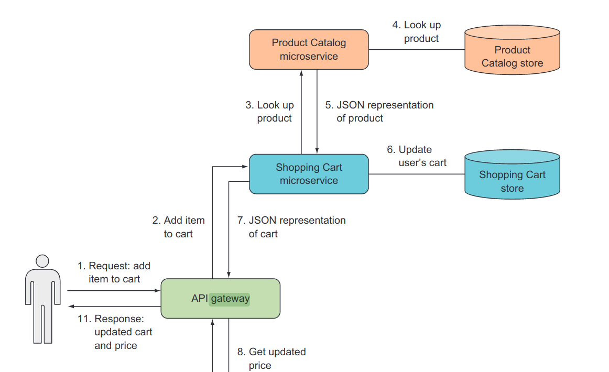
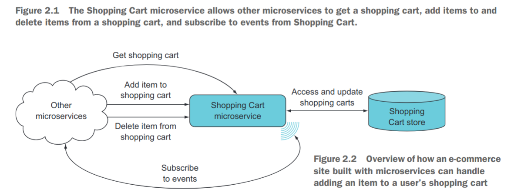

# Shopping Cart API

## Tasks

- Linux containers cluster
- Schema Design
  - Product
  - Cart
  - User
- APIs
  - Product
  - Shopping Cart
  - User

## Architecture

- Shopping Cart - supports foll synchronous requests
  - Getting a shopping cart
  - Adding an item to a shopping cart
  - Deleting an item from shopping cart

## Resources

[link](docs/RESOURCES.md)
